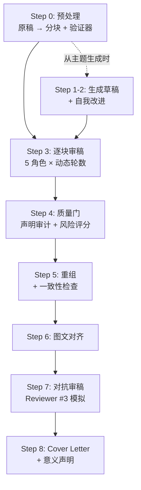
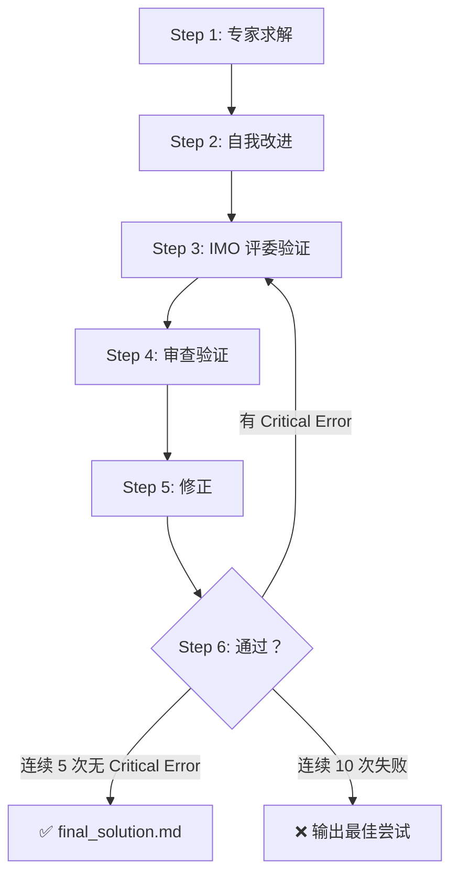

# 🔬 Academic Research AI Pipeline

> 把 AI 变成你的**审稿导师**——自动完成多轮迭代审稿、数值审计、对抗式质疑，输出 Nature 级终稿 + 修改清单 + Cover Letter。

---

## 这套工具在做什么？

想象一下你最好的审稿经历：导师逐段批注，先查物理再查写作；统计专家审公式和误差；一个"刁钻的 Reviewer #3"挑出所有漏洞；最后主编做终审润色。

**这套工具让 AI 模拟这整个过程**——不是一次性"帮我看看"，而是像真实审稿一样：分块、多轮、多角色、逐步收敛。

> 你只需要做一件事：**把稿件放进文件夹，输入 `/research`**。

---

## 为什么不能直接让 AI "帮我审稿"？

### 你可能试过这样做

```
你: 这是我的论文，帮我审稿
AI: 总体来看这篇论文结构清晰，建议加强讨论部分...（泛泛而谈）
```

这不是 AI 不行，而是**你没给它架构**。就像让一个聪明的研究生"随便看看你的论文"vs 给他一份详细的审稿清单——同一个人，产出完全不同。

### 核心观点：输出质量 = 模型能力 × 架构设计

```
没有架构：  Gemini 2.0 × 0 = 泛泛而谈
有架构：    Gemini 2.0 × 好架构 = 专业审稿
未来：      Gemini 3.0 × 好架构 = 更好的审稿（模型升级，架构不用改）
```

**模型会不断升级**——Google 每隔几个月发布更强的版本，你什么都不用做就能受益。但**架构不会自动出现**，它是你对"什么是好审稿"的理解编码成的规则。

> **类比：** 模型是你招来的研究生的智商，架构是你给他的培训体系。智商年年提高（招到更好的学生），但培训体系需要你自己设计。

---

## 架构设计：三个关键决策

### 1. 为什么要分块？

**问题：** 把一篇 8000 字论文整篇丢给 AI，就像让审稿人在 30 分钟内看完整篇论文——他会给你一个"总体印象"，但细节全被忽略。

**解决：** 拆成 5 个小块（≤4000 token），让 AI 一次只看一个章节。

| 就像... | 而不是... |
|---------|----------|
| 导师逐章批注：先看结果，再看讨论 | 导师快速翻一遍说"还行" |
| 审稿人只负责自己擅长的部分 | 一个人匆忙看完所有内容 |

分块方式：
- **chunk A** = 标题 + 摘要（最后审——因为需要根据正文修改）
- **chunk B** = 引言
- **chunk C/D** = 结果（最先审——这是论文核心）
- **chunk E** = 讨论

### 2. 为什么要多轮迭代？

**问题：** 一次审稿只能发现表面问题。你的导师也不会只看一遍就说"改完了，投吧"。

**解决：** 每个 chunk 经过 5 种不同角度的审查，像导师-学生之间的多轮修改：

```
R1 导师说："这里物理有问题，那里写法不规范"
    ↓
R2 学生改了，导师验证："改对了，但引入了一个新问题"
    ↓
R3 另一个教授质疑："你考虑过替代解释吗？对照实验呢？"
    ↓
R4 统计顾问说："这个误差棒怎么算的？N 是多少？"
    ↓
R5 期刊编辑终审："Nature 的读者能看懂这句话吗？"
```

连续 3 轮没有重大问题 → 这个 chunk 通过。否则继续迭代（最多 10 轮）。

### 3. 为什么要角色轮换？

**问题：** 同一个人反复看同一段文字，会产生"审阅疲劳"。AI 也一样——如果 5 轮都用相同的指令，第 3 轮开始就会重复之前的意见。

**解决：** 5 种角色，每种有独立的检查清单（对应一个 skill 文件），互不干扰：

| 角色 | 对应你学术生活中的... | 只关注 |
|------|---------------------|--------|
| 🔬✍️ 导师 | 你的 PhD advisor | 物理正确性 + 写作规范 |
| 🎭 魔鬼代言人 | 最刁钻的 Reviewer #3 | 漏洞、缺失对照、替代解释 |
| 📐 数值审计 | 合作者中的统计学家 | 公式、量纲、N、误差棒 |
| 📝 终审编辑 | Nature 的资深编辑 | 可读性、影响力、期刊风格 |

---

## 你可以（而且应该）自己改

这套工具不是黑盒。每个文件都是**你看得懂的 Markdown 文本**：

| 文件 | 是什么 | 你可以改什么 |
|------|--------|-------------|
| `.agent/workflows/research.md` | 9 步流程定义 | 调整步骤顺序、增删步骤、改迭代规则 |
| `skills/academic-reviewer/SKILL.md` | 导师审稿清单 | 增删检查项、调整你的学科要求 |
| `skills/academic-interviewer/SKILL.md` | 魔鬼代言人规则 | 改攻击角度、加你领域特有的质疑方向 |
| `skills/academic-analyst/SKILL.md` | 数值审计规则 | 加你常用的统计方法检查要求 |

**最方便的改法：直接让 Antigravity 帮你改。** 举几个例子：

```
你: 打开 academic-reviewer 的 SKILL.md，帮我加一条检查项：
    "是否引用了 2024 年以后的文献"

你: 修改 research.md，把目标期刊从 Nature Photonics 改成 JACS

你: 帮我新建一个 skill，专门做有机化学的命名法检查

你: R3 的魔鬼代言人太激进了，改温和一点
```

AI 会直接读取并修改这些文件——你不需要懂编程，用自然语言描述你想要的变化就行。

> [!TIP]
> **进化你的架构：** 如果你发现某类问题每篇论文都会出现（比如"总是漏引用课题组最近的文章"），就把它加到检查清单里。这样你的审稿系统会越用越精准。

---

## 前提

- 已安装 [**Antigravity**](https://blog.google/technology/google-deepmind/gemini-model-policy-updates-january-2025/)（Google DeepMind 的 AI 助手）
- 用 Antigravity 打开一个**项目文件夹**
- 无需编程基础

---

## 部署

### 方法一：`git clone` 新建项目（推荐）

```bash
# 1. Clone 仓库
git clone https://github.com/kirayuta/academic-research-pipeline.git my-paper-review
cd my-paper-review

# 2. 把你的稿件放进来
# Windows:
copy "C:\path\to\my_paper.txt" .
# Mac/Linux:
# cp ~/path/to/my_paper.txt .
```

用 Antigravity 打开 `my-paper-review` 文件夹 → 对话中输入 `/research` → 开始。

### 方法二：添加到已有项目

```bash
# 1. Clone 到临时目录
git clone https://github.com/kirayuta/academic-research-pipeline.git _temp

# 2. 复制到你的项目（Windows PowerShell）
$dst = "D:\YourProject"                                         # ← 改成你的路径
New-Item -ItemType Directory -Path "$dst\.agent\workflows" -Force | Out-Null
Copy-Item "_temp\.agent\workflows\*" "$dst\.agent\workflows\" -Recurse
Copy-Item "_temp\skills" "$dst\skills" -Recurse -Force

# 3. 清理
Remove-Item "_temp" -Recurse -Force
```

### 验证

检查你的文件夹结构：

```
你的项目/
├── .agent/
│   └── workflows/
│       ├── research.md    ✅ 审稿流程
│       └── imo.md         ✅ 数学求解（可选）
├── skills/                ✅ 应有 11 个子文件夹
│   ├── academic-analyst/
│   ├── academic-editor/
│   ├── academic-interviewer/
│   ├── academic-reviewer/
│   ├── academic-writer/
│   ├── manuscript-preprocessor/
│   ├── super-analyst/
│   ├── super-editor/
│   ├── super-fact-checker/
│   ├── super-interviewer/
│   └── super-writer/
└── your_manuscript.txt    ← 你的稿件
```

> [!NOTE]
> `.agent` 是隐藏文件夹。Windows 资源管理器中需开启 **查看 → 显示 → 隐藏的项目**。

---

## 使用方法

### /research — 论文审稿

```
你: /research
（AI 自动读取流程文件并开始执行，你不用额外指令）
```

#### 9 步流程



| 步骤 | 做什么 | 人话翻译 |
|------|--------|----------|
| **Step 0** | 预处理 + 分块 | 把原稿拆成 5 个章节块 + 生成检查矩阵 |
| Step 1–2 | 生成草稿 | *仅从主题写新论文时* |
| **Step 3** | 🔁 逐块审稿 | **核心**：5 种角色轮换 × 动态轮数 |
| **Step 4** | 质量门 | 检查所有声明是否有证据支撑 |
| **Step 5** | 重组 | 把 5 个修改后的 chunk 合并，检查一致性 |
| Step 6 | 图文对齐 | 正文说"见 Fig. 3a"，caption 里真的有 Fig. 3a 吗？ |
| Step 7 | 对抗审稿 | 模拟最刁钻的 Reviewer #3 |
| Step 8 | Cover Letter | 投稿信 + 推荐审稿人 |

#### 使用技巧

| 技巧 | 说明 |
|------|------|
| 📄 稿件格式 | 纯文本 `.txt` 效果最好（Word → 另存为 → 纯文本） |
| 📁 一篇一目录 | 每篇稿件单独放一个空文件夹 |
| 🎯 看什么 | 完成后**第一个打开 `author_queries.md`**——你的 TODO 清单 |
| 🏷️ 换期刊 | 对话中说"目标期刊是 ACS Nano"即可 |

### /imo — 数学竞赛求解

```
你: /imo
你: [粘贴题目]
```



---

## 输出文件速查

运行 `/research` 完成后你会看到这些文件：

### ⭐ 先看这三个

| 文件 | 干什么用 |
|------|----------|
| **`author_queries.md`** | **你的 TODO 清单**——15 个左右需要你确认的问题 |
| **`final_manuscript.md`** | 修改后的终稿——搜 `[PLACEHOLDER` 找待确认处 |
| **`cover_letter_draft.md`** | 投稿信草稿 + 推荐审稿人 |

### 📋 想看细节时

| 文件 | 说明 |
|------|------|
| `chunk_X_review.md` | 每个章节的详细审稿意见 |
| `adversarial_review.md` | Reviewer #3 的攻击报告 |
| `claim_evidence_matrix.md` | "你声称了什么 vs 你有什么证据"对照表 |
| `consistency_checklist.md` | 全文一致性（术语、数值、引用） |

### 📁 中间过程文件

`draft_v1.md`（格式化原稿）· `chunk_A–E.md`（拆分的章节块）· `frozen/`（锁定的 Methods 等）

---

## 高级用法

### 只跑部分步骤

```
你: /research
你: 只做 Step 0，我先看看分块结果

你: /research
你: 从 Step 3 继续，chunk 文件已经在了
```

### 调整审稿强度

```
你: 目标期刊是 ACS Nano（不是 Nature，别太严格）
你: 重新审稿 chunk_C，统计部分需要更严格
```

### 独立使用 Skill

不用跑完整流程，也可以直接引用某个 skill：

```
你: 用 academic-reviewer 的清单帮我审第三段
你: 用 super-fact-checker 帮我核查这些数据
你: 用 super-analyst 帮我分析这个实验方案的可行性
```

---

## FAQ

<details>
<summary><b>稿件格式有要求吗？</b></summary>

纯文本 `.txt` 效果最好。Word 文件需先另存为纯文本（去掉页眉页脚）。
</details>

<details>
<summary><b>跑一次要多久？</b></summary>

短稿 (~3000 字) 约 20–40 分钟，长稿 (8000+ 字) 约 1–2 小时。
</details>

<details>
<summary><b>会修改我的原稿吗？</b></summary>

不会。你的原始 `.txt` 完全不受影响。AI 生成独立的 `final_manuscript.md`。所有不确定的修改用 `[PLACEHOLDER:AQ-N]` 标记，等你确认。
</details>

<details>
<summary><b>可以中途停吗？</b></summary>

可以。每个 chunk 的审稿结果独立保存。下次新开对话，输入 `/research` 并说"从 Step X 继续"。
</details>

<details>
<summary><b>AI 对话中断了怎么办？</b></summary>

新开对话 → `/research` → "从 Step X 继续，文件已在文件夹中"。AI 会读取已有文件接续。
</details>

<details>
<summary><b>适用于哪些学科？</b></summary>

默认针对物理/光学/材料 + Nature 系列优化。但你可以通过修改 skill 检查清单和指定目标期刊来适配任何实验科学领域。你也可以让 Antigravity 帮你做这些修改。
</details>

<details>
<summary><b>我不会编程，能改这些文件吗？</b></summary>

能。所有文件都是纯文本（Markdown），而且你可以直接让 Antigravity 帮你改——用自然语言描述你想要的变化即可。参见上方"你可以（而且应该）自己改"章节。
</details>

---

## License

MIT
