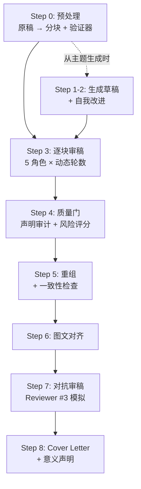
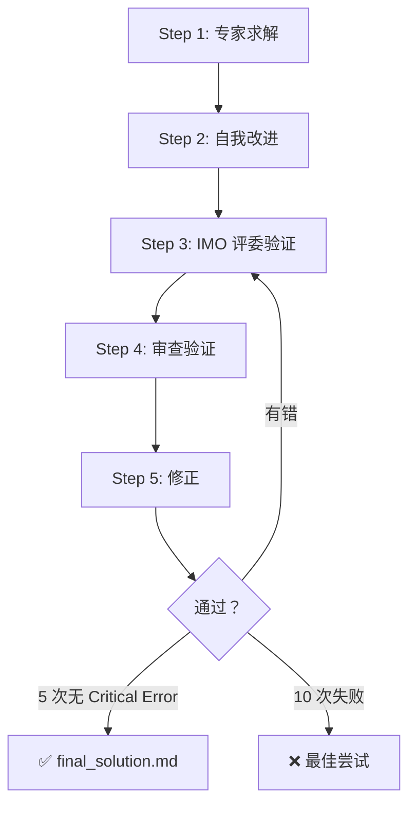

# 🔬 Academic Research AI Pipeline

> 把 Antigravity 变成你的**论文审稿导师 + 数值审计员 + 魔鬼代言人**——一键启动完整多轮迭代审稿流程。

---

## 目录

- [30 秒上手](#30-秒上手)
- [工作原理](#工作原理)
- [部署到你的项目](#部署到你的项目)
- [/research — 论文审稿](#research--论文审稿)
- [/imo — 数学竞赛求解](#imo--数学竞赛求解)
- [Skills 技能模块](#skills-技能模块)
- [输出文件速查](#输出文件速查)
- [高级用法](#高级用法)
- [FAQ](#faq)

---

## 30 秒上手

**你已经有 Antigravity 了，只需 3 步：**

```
1️⃣  把稿件（.txt）放到项目文件夹下
2️⃣  在 Antigravity 对话框输入：/research
3️⃣  等着收结果（全自动，不用额外指令）
```

> [!TIP]
> `/research` 是斜杠命令，Antigravity 会自动读取 workflow 文件并逐步执行。你只需提供稿件，不需要手动指引 AI 每一步做什么。

---

## 工作原理

这套系统由 **2 层** 组成：

```
你的项目/
├── .agent/workflows/        ← 🔗 工作流（定义"做什么"）
│   ├── research.md           ← 论文审稿 9 步流水线 v5.3
│   └── imo.md                ← 数学竞赛 6 步求解器
│
├── skills/                   ← 🧠 技能模块（定义"怎么做"）
│   ├── manuscript-preprocessor/  ← 原稿 → 分块
│   ├── academic-reviewer/        ← 导师审稿（物理+写作）
│   ├── academic-interviewer/     ← 魔鬼代言人
│   ├── academic-analyst/         ← 数值/统计审计
│   ├── academic-editor/          ← Nature 级润色
│   ├── academic-writer/          ← 学术写作
│   ├── super-analyst/            ← 系统分析
│   ├── super-editor/             ← 高级编辑
│   ├── super-fact-checker/       ← 事实核查
│   ├── super-interviewer/        ← 深度质询
│   └── super-writer/             ← 高级写作
│
└── my_paper.txt              ← 你的稿件
```

**Workflow** 告诉 AI 执行流程（先分块 → 再审稿 → 再重组...）；**Skill** 告诉 AI 在每个步骤中扮演什么角色、用什么检查清单。输入 `/research` 后，一切自动串联。

### 核心概念速查

| 术语 | 含义 |
|------|------|
| **Chunk** | 论文被拆成 ≤4000 token 的小块（A=摘要, B=引言, C/D=结果, E=讨论），逐块审稿 |
| **Frozen** | 锁定不审的章节（Methods, References），放在 `frozen/` 目录 |
| **P0 / P1 / P2** | 问题优先级：P0 必须改 · P1 强烈建议改 · P2 建议改 |
| **AQ-N** | Author Query #N，需要作者确认的问题，汇总在 `author_queries.md` |
| **R1–R5** | 5 种审稿角色轮换（导师 → 修改 → 魔鬼代言人 → 数值审计 → 终审） |

---

## 部署到你的项目

> [!IMPORTANT]
> 需要复制 **2 样东西**：`.agent/workflows/` + `skills/`。缺一不可。

### 方法一：PowerShell 一键复制

```powershell
# ✏️ 修改这两个路径
$src = "G:\My Drive\2026\IMOtest"
$dst = "D:\YourNewProject"

# 复制 workflows
New-Item -ItemType Directory -Path "$dst\.agent\workflows" -Force
Copy-Item "$src\.agent\workflows\*" "$dst\.agent\workflows\" -Recurse

# 复制 skills
Copy-Item "$src\skills" "$dst\skills" -Recurse -Force
```

### 方法二：手动复制

1. 打开源项目文件夹，找到 `.agent\workflows\` ⚠️（隐藏文件夹，需在资源管理器 → 查看 → 勾选"隐藏的项目"）
2. 复制 `.agent\` 文件夹到目标项目根目录
3. 复制 `skills\` 文件夹到目标项目根目录
4. 把你的稿件放进去

### 验证

```powershell
# 检查文件是否到位
Get-ChildItem "$dst\.agent\workflows"   # 应看到 research.md, imo.md
Get-ChildItem "$dst\skills" -Directory  # 应看到 11 个文件夹
```

部署完成后，在 VS Code 打开目标项目 → 新建 Antigravity 对话 → 输入 `/research` → 开始！

> [!CAUTION]
> **不要复制** `temp_skills_repo/`、`__pycache__/`、`New folder*/`——它们是运行时产生的临时文件，不属于工具包。

---

## /research — 论文审稿

**一句话：** 把原稿变成 Nature 级终稿 + 审稿意见 + Cover Letter。

### 基本用法

```
# 审稿已有论文
你: /research
（AI 自动找到文件夹中的稿件并开始处理）

# 从主题生成论文
你: /research
你: 帮我写一篇关于 [主题] 的论文
```

### 完整 9 步流程



### Step 3 核心：5 种角色轮换

| 轮次 | 角色 | 做什么 | 对应 Skill |
|------|------|--------|-----------|
| **R1** | 🔬✍️ 导师双轨 | 物理正确性 + 写作规范 | `academic-reviewer` |
| **R2** | 🔄 修改验证 | R1 意见 → 结构化 diff 修改 | `academic-reviewer` |
| **R3** | 🎭 魔鬼代言人 | 攻击假设、缺失对照、替代方法 | `academic-interviewer` |
| **R4** | 📐 数值审计 | 公式推导、量纲、统计检验 | `academic-analyst` |
| **R5** | 📝 终审润色 | 期刊风格、影响力、可读性 | `academic-editor` |

**自动收敛：** 每 chunk 根据复杂度算最少轮数（3-6），最多 10 轮。连续 3 轮无 P0 → 自动通过。

### 使用技巧

- **稿件格式**：纯文本 `.txt` 效果最好（Word → 另存为 .txt）
- **一篇一个文件夹**：把稿件单独放在一个干净子文件夹中
- **最先看 `author_queries.md`**：这是你需要行动的 TODO 清单
- **可指定期刊**：`目标期刊是 ACS Nano` → AI 自动调整审稿标准

---

## /imo — 数学竞赛求解

```
你: /imo
你: [粘贴数学题]
```



---

## Skills 技能模块

每个 skill = 一个文件夹 + 一个 `SKILL.md`（定义角色、检查清单、输出格式）。

### 被 /research 自动调用的

| Skill | 做什么 | 在哪步调用 |
|-------|--------|-----------|
| `manuscript-preprocessor` | 原稿 → Markdown 分块 | Step 0 |
| `academic-reviewer` | 🔬✍️ 物理 + 写作双轨审稿 | Step 3 R1-R2 |
| `academic-interviewer` | 🎭 攻击核心假设、缺失对照 | Step 3 R3 |
| `academic-analyst` | 📐 公式推导、统计审计 | Step 3 R4 |
| `academic-editor` | 📝 Nature 风格终审 | Step 3 R5 |
| `academic-writer` | 从主题生成论文 | Step 1 |

### 可以独立使用的

你不需要跑完整 workflow，也可以在对话中直接引用 skill：

```
你: 用 super-fact-checker 帮我核查这段话的数据
你: 用 academic-reviewer 的清单帮我审一下这段
你: 用 super-analyst 分析一下这个问题
```

| Skill | 做什么 |
|-------|--------|
| `super-analyst` | 判断复杂度 → 选框架 → 系统分析 |
| `super-editor` | 高级润色 |
| `super-fact-checker` | 事实核查 + 引用验证 |
| `super-interviewer` | 苏格拉底式深度追问 |
| `super-writer` | 高级学术写作 |

---

## 输出文件速查

运行 `/research` 后生成的文件（按重要性排序）：

### ⭐ 必看

| 文件 | 说明 |
|------|------|
| **`author_queries.md`** | **你的 TODO 清单**——所有需确认的问题，按 P0→P2 排列 |
| **`final_manuscript.md`** | 多轮审稿后的终稿（含 `[PLACEHOLDER]` 标记待确认处） |
| **`cover_letter_draft.md`** | Cover Letter + 推荐/排除审稿人 |

### 📋 审稿详情

| 文件 | 说明 |
|------|------|
| `chunk_X_review.md` | 每个 chunk 的逐轮审稿记录 |
| `adversarial_review.md` | 模拟最严 Reviewer #3 |
| `quality_gate.md` | 质量门报告 + 风险评分 |

### 🔍 验证矩阵

| 文件 | 说明 |
|------|------|
| `claim_evidence_matrix.md` | 每个核心声明的证据类型和支撑强度 |
| `consistency_checklist.md` | 术语、数值、引用一致性 |
| `novelty_statement.md` | 提炼的创新点 |
| `preflight_results.md` | 预检（过度声明、讨论结构、引用覆盖） |

### 📁 中间文件

`draft_v1.md` · `chunk_A/B/C/D/E.md` · `frozen/`（Methods, References 等锁定章节）

---

## 高级用法

### 部分运行

```
你: /research
你: 只做 Step 0（预处理分块），不要开始审稿
你: chunk 文件已经在了，从 Step 3 开始
你: 跳过 Step 7（对抗审稿）
```

### 重审特定 chunk

```
你: 重新审稿 chunk_C，统计部分需要更严格
```

### 调整目标期刊

```
你: /research
你: 目标期刊是 ACS Nano
```

### 自定义 Skill

每个 `SKILL.md` 就是 Markdown 文件。你可以：
- **改检查清单**：增删 `academic-reviewer/SKILL.md` 中的检查项
- **建新 skill**：新建 `skills/my-skill/SKILL.md`
- **改角色分配**：编辑 `research.md` 中的 Round-Skill 对应表

---

## FAQ

**Q: 稿件格式有要求吗？**
纯文本 `.txt` 最佳。Word 导出的也能处理，建议先去掉页眉页脚。

**Q: 跑一次要多久？**
短稿 (~3000 字) 约 20-40 分钟，长稿 (8000+ 字) 约 1-2 小时。

**Q: 会改我的原文吗？**
不会。原始文件不受影响。AI 生成独立的 `final_manuscript.md`，不确定的修改用 `[PLACEHOLDER:AQ-N]` 标记。

**Q: 可以中途停吗？**
可以。每个 chunk 的审稿结果独立保存。下次告诉 AI 从哪一步继续。

**Q: 报 "skill not found"？**
检查 `skills/` 在项目根目录下（不是 `.agent/` 里面），且每个子文件夹有 `SKILL.md`。

**Q: Antigravity 对话的上下文用完了怎么办？**
长稿审稿可能消耗大量 token。如果对话被截断：
1. 新开一个对话
2. 告诉 AI：`/research`，从 Step X 继续，chunk 文件已在文件夹中
3. AI 会读取已有文件并接续流程
