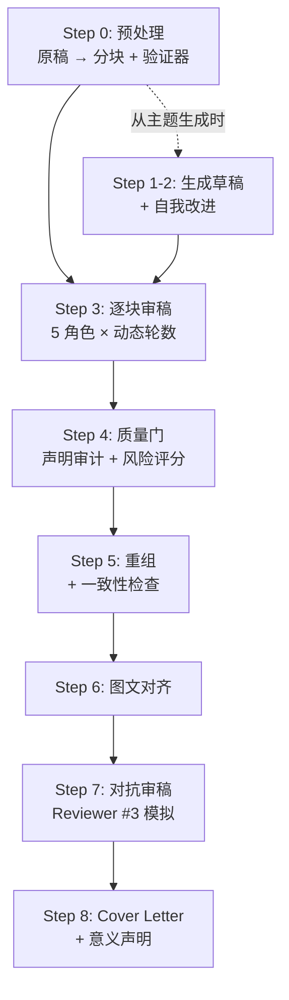
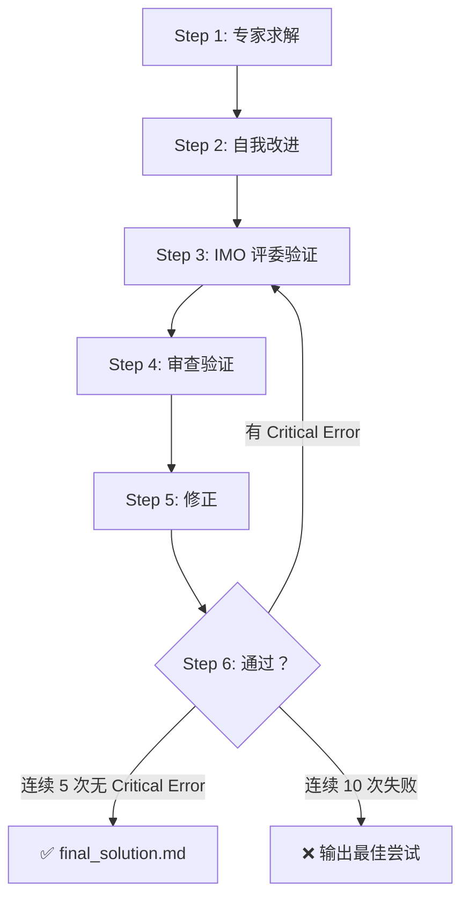

# 🔬 Academic Research AI Pipeline

> 把 AI 变成你的**审稿导师**——自动完成多轮迭代审稿、数值审计、对抗式质疑，输出 Nature 级终稿 + 修改清单 + Cover Letter。

---

## 设计思路

### 来源

`/imo` 工作流改编自 Stanford 发表的 arXiv 论文 [*Winning Gold at IMO 2025 with a Model-Agnostic Verification-and-Refinement Pipeline*](https://arxiv.org/abs/2506.18691)——用 Solver-Verifier 循环迭代求解数学竞赛题。`/research` 在此基础上扩展为学术论文场景：增加分块、角色轮换、多验证器。记忆管理机制（`revision_history.md` 滚动压缩 + `frozen/` 锁定非审稿章节）借鉴了 [OpenClaw](https://github.com/openclaw) 的上下文管理策略。

### 核心观点

**输出质量 = 模型 × 架构。** 模型持续升级（你自动受益），架构需要你设计——本工具包就是这个架构。

- **分块**：整篇丢给 AI 只会得到笼统印象。拆成 ≤4000 token 的章节块，逐块精审，无处偷懒。
- **多轮迭代**：单次审稿只发现表面问题。R1→R2→R3→R4→R5 逐层递进，连续 3 轮无 P0 才通过。
- **角色轮换**：同一 prompt 反复审同一段，第 3 轮开始重复。5 种角色各有独立检查清单，互不干扰。

### 架构特点

| 特点 | 说明 |
|------|------|
| **Solver-Verifier 分离** | 生成和验证由不同角色执行，避免自我确认偏差 |
| **中文 Skill 清单** | 检查清单用中文写成，消除语言隔阂，教授和学生可直接审阅和修改 |
| **六层编辑法** | Editor skill 按逻辑→结构→段落→句子→词语→格式递进，不会混淆层次 |
| **假设压力测试** | Interviewer skill 内置 Devil's Advocate + Hypothesis Stress Test，模拟答辩质询 |
| **Token 预算管理** | 分块 + revision_history 滚动压缩 + frozen 锁定，长论文不会撑爆上下文 |
| **模型无关** | 纯 Markdown 架构，不依赖特定模型版本。Gemini 升级 → 输出自动变好 |

### 自定义

所有文件都是 Markdown 文本。**直接让 Antigravity 帮你改就行**：

```
你: 帮我在 academic-reviewer 的检查清单里加一条：是否引用了 2024 年以后的文献
你: 帮我新建一个 skill，专门做有机化学命名法检查
你: R3 太激进了，改温和一点
```

> [!TIP]
> 每次用完发现重复出现的问题，就加到检查清单里——你的架构会越用越精准。

---

## 前提

- 已安装 [**Antigravity**](https://blog.google/technology/google-deepmind/gemini-model-policy-updates-january-2025/)（Google DeepMind 的 AI 助手）
- 用 Antigravity 打开一个**项目文件夹**
- 无需编程基础

---

## 部署

### 方法一：`git clone` 新建项目（推荐）

```bash
# 1. Clone 仓库
git clone https://github.com/kirayuta/academic-research-pipeline.git my-paper-review
cd my-paper-review

# 2. 把你的稿件放进来
# Windows:
copy "C:\path\to\my_paper.txt" .
# Mac/Linux:
# cp ~/path/to/my_paper.txt .
```

用 Antigravity 打开 `my-paper-review` 文件夹 → 对话中输入 `/research` → 开始。

### 方法二：添加到已有项目

```bash
# 1. Clone 到临时目录
git clone https://github.com/kirayuta/academic-research-pipeline.git _temp

# 2. 复制到你的项目（Windows PowerShell）
$dst = "D:\YourProject"                                         # ← 改成你的路径
New-Item -ItemType Directory -Path "$dst\.agent\workflows" -Force | Out-Null
Copy-Item "_temp\.agent\workflows\*" "$dst\.agent\workflows\" -Recurse
Copy-Item "_temp\skills" "$dst\skills" -Recurse -Force

# 3. 清理
Remove-Item "_temp" -Recurse -Force
```

### 验证

检查你的文件夹结构：

```
你的项目/
├── .agent/
│   └── workflows/
│       ├── research.md    ✅ 审稿流程
│       └── imo.md         ✅ 数学求解（可选）
├── skills/                ✅ 应有 11 个子文件夹
│   ├── academic-analyst/
│   ├── academic-editor/
│   ├── academic-interviewer/
│   ├── academic-reviewer/
│   ├── academic-writer/
│   ├── manuscript-preprocessor/
│   ├── super-analyst/
│   ├── super-editor/
│   ├── super-fact-checker/
│   ├── super-interviewer/
│   └── super-writer/
└── your_manuscript.txt    ← 你的稿件
```

> [!NOTE]
> `.agent` 是隐藏文件夹。Windows 资源管理器中需开启 **查看 → 显示 → 隐藏的项目**。

---

## 使用方法

### /research — 论文审稿

```
你: /research
（AI 自动读取流程文件并开始执行，你不用额外指令）
```

#### 9 步流程



| 步骤 | 做什么 | 人话翻译 |
|------|--------|----------|
| **Step 0** | 预处理 + 分块 | 把原稿拆成 5 个章节块 + 生成检查矩阵 |
| Step 1–2 | 生成草稿 | *仅从主题写新论文时* |
| **Step 3** | 🔁 逐块审稿 | **核心**：5 种角色轮换 × 动态轮数 |
| **Step 4** | 质量门 | 检查所有声明是否有证据支撑 |
| **Step 5** | 重组 | 把 5 个修改后的 chunk 合并，检查一致性 |
| Step 6 | 图文对齐 | 正文说"见 Fig. 3a"，caption 里真的有 Fig. 3a 吗？ |
| Step 7 | 对抗审稿 | 模拟最刁钻的 Reviewer #3 |
| Step 8 | Cover Letter | 投稿信 + 推荐审稿人 |

#### 使用技巧

| 技巧 | 说明 |
|------|------|
| 📄 稿件格式 | 纯文本 `.txt` 效果最好（Word → 另存为 → 纯文本） |
| 📁 一篇一目录 | 每篇稿件单独放一个空文件夹 |
| 🎯 看什么 | 完成后**第一个打开 `author_queries.md`**——你的 TODO 清单 |
| 🏷️ 换期刊 | 对话中说"目标期刊是 ACS Nano"即可 |

### /imo — 数学竞赛求解

```
你: /imo
你: [粘贴题目]
```



---

## 输出文件速查

运行 `/research` 完成后你会看到这些文件：

### ⭐ 先看这三个

| 文件 | 干什么用 |
|------|----------|
| **`author_queries.md`** | **你的 TODO 清单**——15 个左右需要你确认的问题 |
| **`final_manuscript.md`** | 修改后的终稿——搜 `[PLACEHOLDER` 找待确认处 |
| **`cover_letter_draft.md`** | 投稿信草稿 + 推荐审稿人 |

### 📋 想看细节时

| 文件 | 说明 |
|------|------|
| `chunk_X_review.md` | 每个章节的详细审稿意见 |
| `adversarial_review.md` | Reviewer #3 的攻击报告 |
| `claim_evidence_matrix.md` | "你声称了什么 vs 你有什么证据"对照表 |
| `consistency_checklist.md` | 全文一致性（术语、数值、引用） |

### 📁 中间过程文件

`draft_v1.md`（格式化原稿）· `chunk_A–E.md`（拆分的章节块）· `frozen/`（锁定的 Methods 等）

---

## 高级用法

### 只跑部分步骤

```
你: /research
你: 只做 Step 0，我先看看分块结果

你: /research
你: 从 Step 3 继续，chunk 文件已经在了
```

### 调整审稿强度

```
你: 目标期刊是 ACS Nano（不是 Nature，别太严格）
你: 重新审稿 chunk_C，统计部分需要更严格
```

### 独立使用 Skill

不用跑完整流程，也可以直接引用某个 skill：

```
你: 用 academic-reviewer 的清单帮我审第三段
你: 用 super-fact-checker 帮我核查这些数据
你: 用 super-analyst 帮我分析这个实验方案的可行性
```

---

## FAQ

<details>
<summary><b>稿件格式有要求吗？</b></summary>

纯文本 `.txt` 效果最好。Word 文件需先另存为纯文本（去掉页眉页脚）。
</details>

<details>
<summary><b>跑一次要多久？</b></summary>

短稿 (~3000 字) 约 20–40 分钟，长稿 (8000+ 字) 约 1–2 小时。
</details>

<details>
<summary><b>会修改我的原稿吗？</b></summary>

不会。你的原始 `.txt` 完全不受影响。AI 生成独立的 `final_manuscript.md`。所有不确定的修改用 `[PLACEHOLDER:AQ-N]` 标记，等你确认。
</details>

<details>
<summary><b>可以中途停吗？</b></summary>

可以。每个 chunk 的审稿结果独立保存。下次新开对话，输入 `/research` 并说"从 Step X 继续"。
</details>

<details>
<summary><b>AI 对话中断了怎么办？</b></summary>

新开对话 → `/research` → "从 Step X 继续，文件已在文件夹中"。AI 会读取已有文件接续。
</details>

<details>
<summary><b>适用于哪些学科？</b></summary>

默认针对物理/光学/材料 + Nature 系列优化。但你可以通过修改 skill 检查清单和指定目标期刊来适配任何实验科学领域。你也可以让 Antigravity 帮你做这些修改。
</details>

<details>
<summary><b>我不会编程，能改这些文件吗？</b></summary>

能。所有文件都是纯文本（Markdown），而且你可以直接让 Antigravity 帮你改——用自然语言描述你想要的变化即可。参见上方"你可以（而且应该）自己改"章节。
</details>

---

## License

MIT
